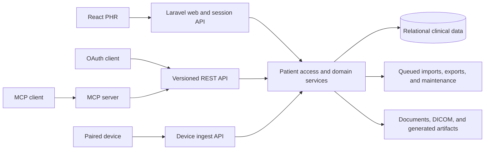

# PHR — Personal Health Record

PHR is a patient-centered health record application for collecting, organizing,
reviewing, and exchanging longitudinal medical information. It combines structured
clinical records with source documents and medical imaging while preserving the
provenance that connects an imported fact to its original evidence.

The application is built with Laravel 13, React 19, TypeScript, and Vite. It can be
used through the browser, a versioned OAuth API, or an MCP client.

## What it does

- Organizes office visits, procedures, medications, conditions, allergies,
  immunizations, labs, vitals, health logs, and insurance EOBs by patient.
- Stores supporting documents and links them to the clinical records derived from
  them.
- Imports C-CDA, FHIR R4 bundles, MyChart archives, EOB data, and reviewed structured
  extraction results.
- Imports and displays DICOM studies, including conventional viewers and a 3D volume
  exploration workflow.
- Searches a selected patient's structured records, notes, document metadata, and
  available extracted text.
- Exports clinical summaries as C-CDA, FHIR, and PDF, and creates a native archive
  that preserves PHR-specific records and original files.
- Accepts respiratory event data from Sinus Sentinel and other authorized clients.
- Supports patient sharing with explicit access levels and patient-scoped
  authorization.

## Architecture

The patient is the central security and data boundary. Clinical records, documents,
imaging, imports, exports, and shares all belong to a patient profile. Requests reach
the same access and domain services whether they originate in the browser or through
an integration.



### Browser application

The React application lives in `resources/js/phr`. Its Miller-column shell keeps the
patient context visible while users move from a collection to a record detail view.
Clinical modules share Zod-validated API types, common patient navigation, and a
patient-scoped command search. Blade supplies the authenticated application shell;
React owns the interactive PHR experience.

### Laravel domain

Laravel controllers expose session-authenticated browser endpoints and the external
API. Business rules live in services under `app/Services/PHR`, including patient
access, imports, documents, DICOM processing, health logs, respiratory data, exports,
native backup, restore, and patient deletion. Eloquent models represent clinical
records and their evidence relationships.

`PhrPatientAccessService` is the common authorization boundary. Controllers and
commands resolve a readable, writable, or owned patient before operating on that
patient's data.

### Data and storage

Structured health information is stored relationally so it can be searched, linked,
reviewed, and exported. Larger artifacts are stored through Laravel Flysystem:

- source documents and their extracted text metadata;
- original DICOM instances and derived volume caches;
- generated exports and native backup archives.

Database records retain the storage reference and provenance. Clinical records can
link back to source documents, EOB evidence, and related imaging rather than copying
the underlying artifact.

### Import and review pipeline

Deterministic importers handle C-CDA, FHIR, MyChart, and supported EOB formats.
Document processing can also produce structured proposals from extracted content.
Those proposals are staged for review before acceptance into the clinical model, so
source material and interpreted data remain distinguishable.

Long-running document processing, exports, backup/restore operations, and cleanup use
Laravel queues. Idempotency and source identities allow supported imports and API
writes to be retried safely.

### APIs and integrations

The browser uses patient-scoped JSON endpoints under `/api/phr`. External clients use
the versioned `/api/v1` API with OAuth Authorization Code and PKCE, granular scopes,
and the same patient access rules and JSON resources as the application.

The MCP server is an adapter over that REST surface. Its tools call the versioned API
instead of querying models directly, keeping validation, authorization, rate limits,
and audit behavior in one place. Device pairing and respiratory ingest use a narrower
credential path designed for data-producing devices.

The API contract is published at
[`public/openapi/phr-agent-v1.json`](public/openapi/phr-agent-v1.json). See
[`docs/agent-api-security.md`](docs/agent-api-security.md) for the integration threat
model and security boundaries.

### Data portability

Interoperability exports and native backups serve different purposes:

- C-CDA, FHIR, and PDF provide portable clinical summaries.
- The versioned native archive preserves application-specific relationships and
  original artifacts for lossless backup and restore.

The Data Hub inventories a patient's records and artifacts, creates exports and native
backups, validates native restores before applying them, and coordinates patient
deletion with durable artifact cleanup. The native archive format is documented in
[`docs/phr-native-v1.md`](docs/phr-native-v1.md).

## Repository map

| Path | Responsibility |
| --- | --- |
| `app/Models/Phr*.php` | Patient, clinical, evidence, imaging, and portability models |
| `app/Services/PHR` | Patient access and domain workflows |
| `app/Http/Controllers/PHR` | Browser-facing PHR endpoints |
| `app/Http/Controllers/Api/V1` | OAuth REST API and MCP entry point |
| `app/GenAiProcessor` | Minimal queued document-extraction pipeline |
| `app/Console/Commands/Phr` | Import, export, reconciliation, and maintenance commands |
| `resources/js/phr` | React PHR modules and Miller-column application shell |
| `resources/views/phr` | Blade mounts and server-rendered PDF views |
| `routes/api.php` | Session, device, OAuth API, and MCP routes |
| `docs` | Format, conformance, and security design notes |
| `tests`, `tests-ts`, `tests/e2e` | Backend, frontend, and browser coverage |

## Running locally

Requirements are PHP 8.3–8.5, Composer, Node.js, and pnpm 11.

```bash
composer install
pnpm install
cp .env.example .env
php artisan key:generate
php scripts/configure-agent-mutation-digest-key.php
touch database/database.sqlite
php artisan migrate

composer run dev
```

The default local database is SQLite. Create a local user, grant it the `user` role,
and set its password with:

```bash
php artisan user:set-password you@example.com
```

## Validation

```bash
pnpm run type-check
pnpm run lint
pnpm run test
pnpm run build
pnpm run test:e2e

./vendor/bin/pint --test
composer audit --locked --no-interaction
php -d memory_limit=1G vendor/bin/phpunit
```

The Playwright suite uses isolated local storage and a synthetic OAuth provider. Test
fixtures must remain synthetic.

## Privacy

This repository is public. Do not commit real patient names, dates of birth, record
numbers, provider details, addresses, source documents, DICOM data, or other protected
health information. Code, tests, fixtures, commit messages, issues, and CI output must
use synthetic data.

## Additional documentation

- [C-CDA conformance notes](docs/ccda-conformance.md)
- [Agent API security model](docs/agent-api-security.md)
- [Native backup format](docs/phr-native-v1.md)
