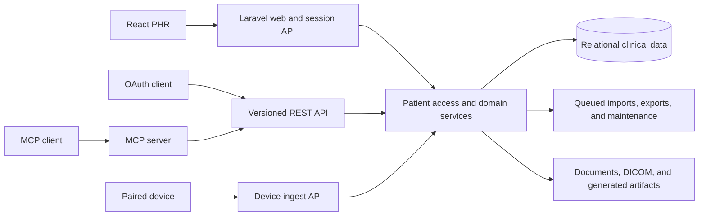

# PHR — Personal Health Record

PHR is a patient-centered health record application for collecting, organizing,
reviewing, and exchanging longitudinal medical information. It combines structured
clinical records with source documents and medical imaging while preserving the
provenance that connects an imported fact to its original evidence.

The application is built with Laravel 13, React 19, TypeScript, and Vite. It can be
used through the browser, a versioned OAuth API, or an MCP client.

## What it does

- Organizes office visits, procedures, medications, conditions, allergies,
  immunizations, labs, vitals, health logs, and insurance EOBs by patient.
- Stores supporting documents and links them to the clinical records derived from
  them.
- Imports C-CDA, FHIR R4 bundles, MyChart archives, EOB data, and reviewed structured
  extraction results.
- Imports and displays DICOM studies, including conventional viewers and a 3D volume
  exploration workflow.
- Searches a selected patient's structured records, notes, document metadata, and
  available extracted text.
- Exports clinical summaries as C-CDA, FHIR, and PDF, and creates a native archive
  that preserves PHR-specific records and original files.
- Accepts respiratory event data from Sinus Sentinel and other authorized clients.
- Supports patient sharing with explicit access levels and patient-scoped
  authorization.

## Architecture

The patient is the central security and data boundary. Clinical records, documents,
imaging, imports, exports, and shares all belong to a patient profile. Requests reach
the same access and domain services whether they originate in the browser or through
an integration.


```mermaid
flowchart LR
    Browser[React PHR] --> Web[Laravel web and session API]
    Client[OAuth client] --> REST[Versioned REST API]
    MCP[MCP client] --> MCPServer[MCP server]
    Device[Paired device] --> DeviceAPI[Device ingest API]

    Web --> Domain[Patient access and domain services]
    REST --> Domain
    MCPServer --> REST
    DeviceAPI --> Domain

    Domain --> DB[(Relational clinical data)]
    Domain --> Queue[Queued imports, exports, and maintenance]
    Domain --> Blobs[Documents, DICOM, and generated artifacts]
```

### Browser application

The React application lives in `resources/js/phr`. Its Miller-column shell keeps the
patient context visible while users move from a collection to a record detail view.
Clinical modules share Zod-validated API types, common patient navigation, and a
patient-scoped command search. Blade supplies the authenticated application shell;
React owns the interactive PHR experience.

### Laravel domain

Laravel controllers expose session-authenticated browser endpoints and the external
API. Business rules live in services under `app/Services/PHR`, including patient
access, imports, documents, DICOM processing, health logs, respiratory data, exports,
native backup, restore, and patient deletion. Eloquent models represent clinical
records and their evidence relationships.

`PhrPatientAccessService` is the common authorization boundary. Controllers and
commands resolve a readable, writable, or owned patient before operating on that
patient's data.

### Data and storage

Structured health information is stored relationally so it can be searched, linked,
reviewed, and exported. Larger artifacts are stored through Laravel Flysystem:

- source documents and their extracted text metadata;
- original DICOM instances and derived volume caches;
- generated exports and native backup archives.

Database records retain the storage reference and provenance. Clinical records can
link back to source documents, EOB evidence, and related imaging rather than copying
the underlying artifact.

### Import and review pipeline

Deterministic importers handle C-CDA, FHIR, MyChart, and supported EOB formats.
Document processing can also produce structured proposals from extracted content.
Those proposals are staged for review before acceptance into the clinical model, so
source material and interpreted data remain distinguishable.

Long-running document processing, exports, backup/restore operations, and cleanup use
Laravel queues. Idempotency and source identities allow supported imports and API
writes to be retried safely.

### APIs and integrations

The browser uses patient-scoped JSON endpoints under `/api/phr`. External clients use
the versioned `/api/v1` API with OAuth Authorization Code and PKCE, granular scopes,
and the same patient access rules and JSON resources as the application.

The MCP server is an adapter over that REST surface. Its tools call the versioned API
instead of querying models directly, keeping validation, authorization, rate limits,
and audit behavior in one place. Device pairing and respiratory ingest use a narrower
credential path designed for data-producing devices.

The API contract is published at
[`public/openapi/phr-agent-v1.json`](public/openapi/phr-agent-v1.json), and served with
the installation's own API and OAuth URLs at `/api/openapi.json`. REST connectors
authenticate with OAuth or with a personal API token; both are created by the signed-in
person under **Config → API Access**, limited to the permissions they choose. See
[`docs/agent-api-security.md`](docs/agent-api-security.md) for the integration threat
model and security boundaries.

## Connect an MCP client

PHR's remote MCP endpoint is `https://phr.bherila.net/api/v1/mcp`. It uses OAuth
with Bherila.net for sign-in; do not create or paste a personal API token. The
browser opened by the login command shows the requested PHR permissions before
continuing to the client.

Install it for your user account, then complete the browser login:

```bash
# Codex CLI
codex mcp add phr --url https://phr.bherila.net/api/v1/mcp \
  --oauth-resource https://phr.bherila.net/api/v1
codex mcp login phr

# Claude Code CLI
claude mcp add --transport http --scope user phr https://phr.bherila.net/api/v1/mcp
claude mcp login phr
```

Restart the client if it was already running. The MCP initialization response teaches
compatible harnesses to call `identity.get`, then use `patients.list` and
`patients.get` to select and confirm a patient without inferring an ID. Clients that
implement MCP prompts can also expose the guided `safely-update-clinical-record` and
`review-import-proposal` workflows when their required tools are authorized. Tool and
prompt discovery is filtered to the connection's granted OAuth scopes, and every call
still enforces patient access through the underlying REST route. Because PHR content is
health information, connect only a client and account you trust.

### Process imports with your own subscription

In **AI Provider Settings**, choose **My subscription client** to keep document
extractions in your private PHR queue instead of calling a server-side model API.
An OAuth-connected Codex, Claude Code, or REST-capable client can drain that queue
ad hoc or on a schedule with the dedicated `genai:read` and `genai:work` scopes.
Files are streamed from short-lived URLs that still require the OAuth bearer header;
they are never embedded in MCP messages. See
[`docs/external-genai-processing.md`](docs/external-genai-processing.md) for the MCP
tools, REST workflow, lease behavior, and hosted-connector limitation.

### Data portability

Interoperability exports and native backups serve different purposes:

- C-CDA, FHIR, and PDF provide portable clinical summaries.
- The versioned native archive preserves application-specific relationships and
  original artifacts for lossless backup and restore.

The Data Hub inventories a patient's records and artifacts, creates exports and native
backups, validates native restores before applying them, and coordinates patient
deletion with durable artifact cleanup. The native archive format is documented in
[`docs/phr-native-v1.md`](docs/phr-native-v1.md).

## Repository map

| Path | Responsibility |
| --- | --- |
| `app/Models/Phr*.php` | Patient, clinical, evidence, imaging, and portability models |
| `app/Services/PHR` | Patient access and domain workflows |
| `app/Http/Controllers/PHR` | Browser-facing PHR endpoints |
| `app/Http/Controllers/Api/V1` | OAuth REST API and MCP entry point |
| `app/GenAiProcessor` | Minimal queued document-extraction pipeline |
| `app/Console/Commands/Phr` | Import, export, reconciliation, and maintenance commands |
| `resources/js/phr` | React PHR modules and Miller-column application shell |
| `resources/views/phr` | Blade mounts and server-rendered PDF views |
| `routes/api.php` | Session, device, OAuth API, and MCP routes |
| `docs` | Format, conformance, and security design notes |
| `tests`, `tests-ts`, `tests/e2e` | Backend, frontend, and browser coverage |

## Running locally

Requirements are PHP 8.4–8.5, Composer, Node.js, and pnpm 11.

```bash
composer install
pnpm install
cp .env.example .env
php artisan key:generate
php scripts/configure-agent-mutation-digest-key.php
touch database/database.sqlite
php artisan migrate

composer run dev
```

The default local database is SQLite. Create a local user, grant it the `user` role,
and set its password with:

```bash
php artisan user:set-password you@example.com
```

## Self-hosting

PHR is self-contained apart from sign-in: a fork deploys with its own identity
provider instance and needs no code changes. Every agent-API URL (OAuth issuer,
protected resource `APP_URL/api/v1`, authorization, token and registration endpoints,
discovery documents) derives from `APP_URL`.

| Setting | Purpose |
|---|---|
| `APP_URL` | The public origin. Everything the OAuth server and API advertise derives from it. |
| `OAUTH_PROVIDER`, `OAUTH_PROVIDER_URL`, `OAUTH_CLIENT_ID`, `OAUTH_CLIENT_SECRET`, `OAUTH_REDIRECT_URI` | Sign-in through your identity provider instance. It only signs people in; PHR runs its own authorization server for agents. |
| `OAUTH_SERVER_ENABLED` | Kill switch for the agent authorization server (default `true`): discovery, registration, authorization and token issuance. |
| `PASSPORT_PRIVATE_KEY`, `PASSPORT_PUBLIC_KEY` | Token signing keys. When unset they are read from `storage/app/private/oauth`; never commit them. |
| `BHERILA_AUTH_TRUSTED_PROXIES`, `TRUSTED_PROXIES` | Whose `X-Forwarded-For`/`-Proto` to believe (default: on, `cloudflare`). Use a comma-separated list for another proxy, `*` only when a firewall admits nothing but the proxy, or empty with no proxy in front. Per-client rate limits key on the resulting address. |
| `AGENT_API_MCP_ALLOWED_ORIGINS`, `AGENT_API_MCP_ALLOWED_HOSTS` | Browser origins and `Host` values the MCP endpoint accepts. |

The agent authorization server follows the auth package's agent preset: S256 PKCE for
every client, public-only self-registration, and credentials bound to
`APP_URL/api/v1`, with an omitted `resource` taken as that one. Edge configuration
(proxy and CDN rules) is deployment-specific and not part of this repository.

## Validation

```bash
pnpm run type-check
pnpm run lint
pnpm run test
pnpm run build
pnpm run test:e2e

./vendor/bin/pint --test
composer audit --locked --no-interaction
php -d memory_limit=1G vendor/bin/phpunit
```

Production deployments opt into the shared action's canonical runtime audit after
final-path cache refresh and again after finalization. Missing or escaped cached
runtime paths fail without provisioning directories. The post-finalizer PHR hook
checks exact serving identity, lock absence, an empty transaction inventory, the
persistent OAuth key pair, and the two canonical scheduler/worker entries with 1G
limits. The shared audit additionally checks persistent database configuration,
pending migrations and aggregate queue counts. Diagnostics consume no queued work
and emit no patient data or key contents. A newer deployment generation supersedes
post-unlock diagnostics rather than falsely failing an earlier healthy release.

Configured hook paths, managed cron and audit memory settings are validated before
remote deployment state changes.

Atomic deployments verify the exact serving release and PHR's HTTP, assets, OAuth,
MCP, OHIF, queue, key and cron contracts before probing web PHP. An inconclusive
PHP probe can leave that verified release serving and uncommitted while the run
fails. HTTP 200 alone cannot grant this exception; failed application checks and
definitive PHP or memory mismatches follow the maintenance failure policy.
The shared health and PHP probes run on the host against its own web server,
while PHR's application verifier checks the public HTTPS endpoints, including
their OAuth, MCP and OHIF access boundaries. HTTP failures report the check name, status,
MIME type, curl exit code and allowlisted Cloudflare indicators. Bodies, cookies,
redirect URLs and raw curl errors remain private and are removed after verification.

The Playwright suite uses isolated local storage and a synthetic OAuth provider. Test
fixtures must remain synthetic.

## Diagnose a deployment left in maintenance

The manual **PHR Maintenance Diagnostic** workflow accepts the exact selected
release and source commit reported by the failed deployment. Run it from `main`
after its changes and pinned shared helpers have been reviewed and merged. It uses
the existing `prod` SSH secrets and queues in the same production concurrency group
as application and OHIF writes. A present deployment lock, interrupted transaction,
unexpected live identity or noncanonical control directory prevents probing.

The diagnostic reports only validated aggregate evidence: canonical maintenance-file presence,
saved application cron presence, selected runtime paths and database persistence,
pending migration and queue counts, `/up` and `/login` HTTP statuses, and web PHP
requirements. `/up` can return 200 while `/login` returns 503 in maintenance; both are
checked. Maintenance-file presence does not infer the state of an alternative cache
maintenance driver. The web PHP helper creates a random temporary file in `public/` and attempts
cleanup on every exit. No service state, cron, migrations, keys or patient data are
changed. A failed web proof reports cleanup as unconfirmed and requires operator
inspection before recovery.

This workflow provides evidence for a deliberate recovery decision. The shared
action's `recovery-release-id` finalizes interrupted transactions; it does not resume
an already finalized release intentionally left in maintenance. The diagnostic
does not resume that release or dispatch a new deployment.

### Production credentials and historical workflow reruns

Production writers and diagnostics use only `PHR_PRODUCTION_SSH_KEY`, backed by a
dedicated restricted ed25519 key. The reviewed credential cutover preserved foreign
server keys and verified a fresh connection using the new key alone. The legacy
`SSH_PRIVATE_KEY` secret was removed from all repository-visible scopes after prior
production-capable runs finished. A rerun of the original pre-policy deployment
then failed at SSH configuration before publication or deployment. The completed
temporary key-bootstrap workflow has been retired.

See the [credential proof](https://github.com/bherila/phr/actions/runs/37247309536)
and [historical rerun denial](https://github.com/bherila/phr/actions/runs/37239370303/attempts/2).
Do not restore the legacy secret name: old workflow definitions would regain their
production credential. Its server authorization remains intact because other
applications may share that key.

## Resume a finalized release left in maintenance

The separate manual **PHR Guarded Maintenance Resume** workflow runs only from
`main`, using the verified `PHR_PRODUCTION_SSH_KEY` credential and the production
writer queue. Review and merge it before dispatch; verify the new credential first.
Supply the exact selected release (`<commit-prefix>-<owning-CI-run>-<attempt>`) and
full source commit. The owning production CI attempt and deployment job must have
completed; cancelled or active attempts are refused.
The owning deployment job must have failed; a successful deployment cannot prove
that it owns a later maintenance marker.
The existing maintenance marker must date to that original deployment job (with
at most one minute of clock skew); its captured timestamp and content hash must
remain unchanged until `up`. A later operator-created marker is refused.

Before any service change, the workflow requires all read-only diagnostic proofs,
a maintenance file, a saved recovery cron file, no active host lock and no pending
transaction. It then acquires the host lock with a unique ownership nonce and repeats
identity, canonical path, persistent database, zero pending migration and web PHP
proofs under that lock. Service state changes use Laravel's existing maintenance
commands, with PHP 8.5 and a 1G limit. Bootstrap caches and facade generation use private temporary paths;
the cached application encryption key is validated and the existing read-only OAuth
key command verifies the canonical persistent signing pair before `up` and before
unlocking. Key file hashes must remain unchanged throughout the operation.
No migrations, application cache refreshes, source, environment, key or patient data
changes are performed. Only file-backed maintenance is supported.

The exact release must serve `/up` with 200 and `/login` with 200 or 302 before the
reviewed shared cron helpers restore the two canonical PHR entries. Other applications'
entries and the saved recovery file are preserved. The recovery file is never installed
as a whole account crontab. Failure after attempting `up` tries `down` and an application-only
cron pause while exact identity, safe config and lock ownership are still provable.
Uncertain ownership or rollback retains the lock and reports unconfirmed recovery;
there is no automatic takeover or claim of successful cleanup. Logs contain fixed
aggregate labels only. A retained lock needs reviewed operator inspection before
another writer or recovery attempt.
Both the host session and SSH transport have total deadlines. An SSH timeout or
disconnect alone does not prove the host has stopped or rollback completed; obtain
fresh read-only evidence and inspect any retained ownership before retrying. Never
blindly rerun or remove a retained lock.

## Privacy

This repository is public. Do not commit real patient names, dates of birth, record
numbers, provider details, addresses, source documents, DICOM data, or other protected
health information. Code, tests, fixtures, commit messages, issues, and CI output must
use synthetic data.

## Additional documentation

- [C-CDA conformance notes](docs/ccda-conformance.md)
- [Agent API security model](docs/agent-api-security.md)
- [Patient authorization capability matrix and call-site inventory](docs/patient-authorization-inventory.md)
- [Native backup format](docs/phr-native-v1.md)

Production ordering, supersession records, OHIF publication proof, and intentional
rollback procedures are described in [.github/deployment-policy.md](.github/deployment-policy.md).
